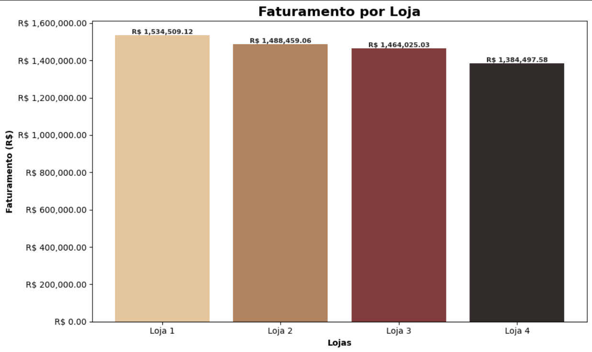
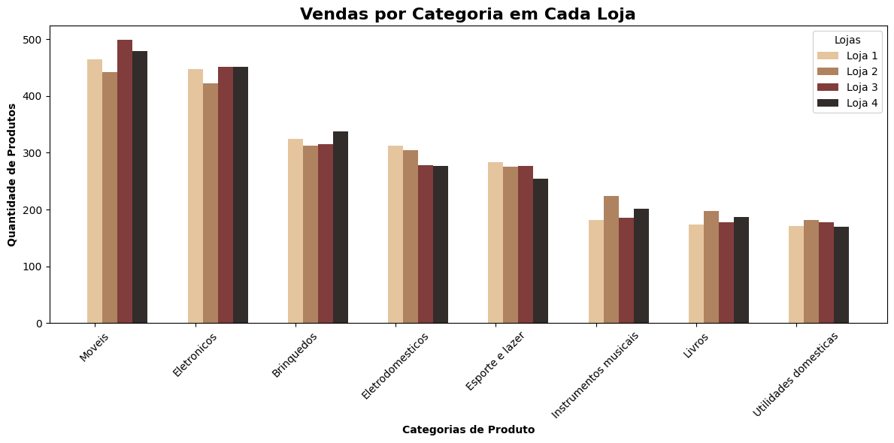
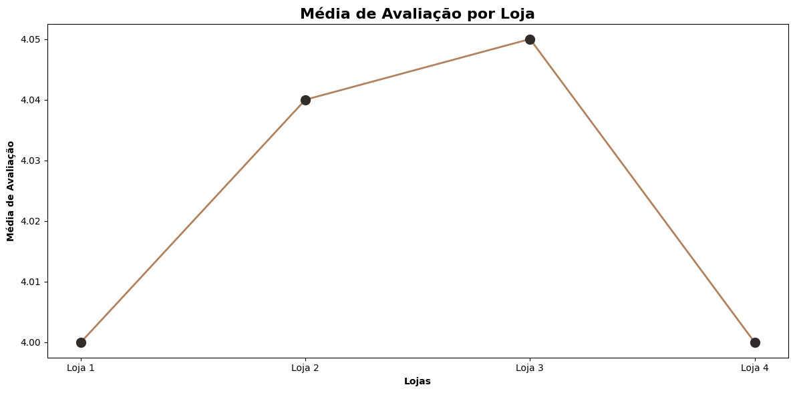
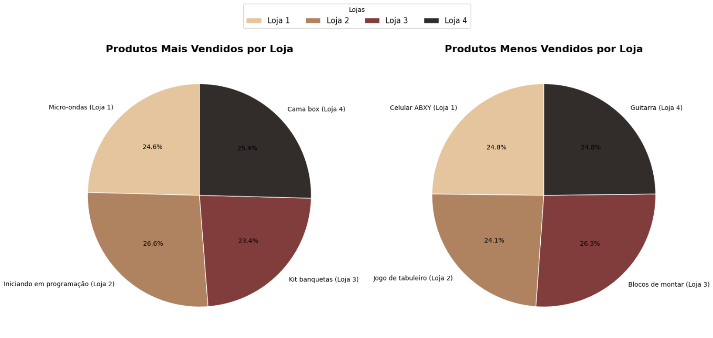
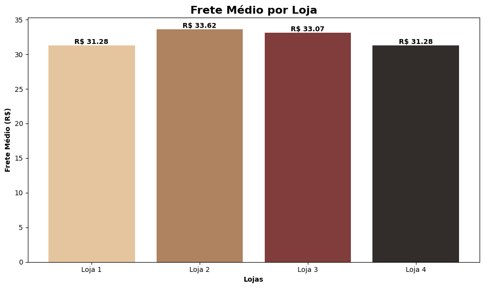

# 🛍️ Análise Comparativa das Lojas AluraStoreBR

Este relatório tem como objetivo analisar o desempenho de quatro lojas pertencentes ao Senhor João, com o intuito de recomendar qual delas deve ser vendida. Para isso, foram avaliados diversos aspectos de desempenho, incluindo o faturamento total, as categorias de produtos mais e menos vendidas, a média das avaliações dos clientes, os produtos mais e menos vendidos e o custo médio de frete em cada loja. A análise foi realizada com base nos dados fornecidos e visualizações geradas, permitindo uma compreensão clara dos pontos fortes e fracos de cada loja.

---

## 📊 Faturamento Total

- **Loja 1:** R$ 1.534.509,12  
- **Loja 2:** R$ 1.488.459,06  
- **Loja 3:** R$ 1.464.025,03  
- **Loja 4:** R$ 1.384.497,58  

A Loja 4 apresenta o menor faturamento, cerca de:
- R$ 150 mil a menos que a Loja 1 (−9,8%)
- R$ 104 mil a menos que a Loja 2 (−7%)
- R$ 80 mil a menos que a Loja 3 (−5,5%)

Esses dados mostram um desempenho financeiro inferior da Loja 4.

---

## 📦 Vendas por Categoria

- **Loja 1:** Móveis (465), Eletrônicos (448)  
- **Loja 2:** Móveis (442), Eletrônicos (422)  
- **Loja 3:** Móveis (499), Eletrônicos (451)  
- **Loja 4:** Baixo volume em Eletrodomésticos (254) e Instrumentos Musicais (170)

A Loja 4 tem menos diversidade nas vendas, o que pode limitar seu alcance de mercado.

---

## 🌟 Avaliação Média dos Clientes

- **Loja 1:** 3,98  
- **Loja 2:** 4,04  
- **Loja 3:** 4,05  
- **Loja 4:** 4,00

A Loja 3 possui a melhor média (4,05). A Loja 4 tem uma média de 4,00 — segunda menor, o que indica espaço para melhorias na experiência do cliente.

---

## 📈 Produtos Mais e Menos Vendidos

- **Loja 1:**  
  - Mais vendido: Micro-ondas (60)  
  - Menos vendido: Celular ABXY (33)

- **Loja 2:**  
  - Mais vendido: Iniciando em Programação (65)  
  - Menos vendido: Jogo de Tabuleiro (32)

- **Loja 3:**  
  - Mais vendido: Kit Banquetas (57)  
  - Menos vendido: Blocos de Montar (35)

- **Loja 4:**  
  - Mais vendido: Cama Box (62)  
  - Menos vendido: Guitarra (33)

Apesar de ter um produto com bom volume de vendas (Cama Box), a Loja 4 não consegue compensar seu desempenho geral.

---

## 🚚 Frete Médio por Loja

- **Loja 1:** R$ 31,28  
- **Loja 2:** R$ 33,62  
- **Loja 3:** R$ 33,07  
- **Loja 4:** R$ 31,28

A Loja 4 possui o menor frete (empatada com a Loja 1), mas sem diferencial competitivo suficiente para compensar os outros indicadores negativos.

---

## ✅ Conclusão

A Loja 4 apresenta o pior desempenho entre as quatro, com o menor faturamento (R$ 1.384.497,58), a segunda menor avaliação média dos clientes (4,00) e menor diversidade em categorias importantes. Apesar do frete médio competitivo, isso não compensou seu baixo desempenho geral.

💡 **Recomendação:**  
O Senhor João deve considerar **vender a Loja 4** e concentrar seus recursos nas demais lojas, que apresentam melhor desempenho e maior potencial de crescimento.

---
*Este relatório foi desenvolvido como desafio do curso de Data Science da Alura.*

